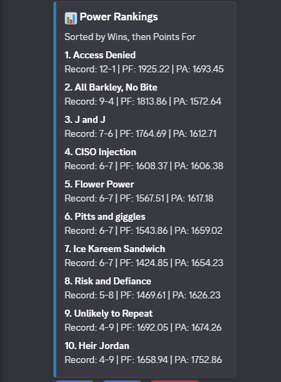

Thank you for adding the ESPN Fantasy Football Discord Bot!

(This bot is not associated with ESPN)

This is a bot that will send helpful data related to your fantasty football league including:

    1. Head to Head Matchup Results
    2. The Top Player per Position of the Week
    3. The Top 5 Points Leaders per Position
    4. League Power Rankings

In order to use this bot properly you need to gather your: LEAGUE ID, LEAGUE YEAR, SWID KEY, and ESPN_S2 KEY, and the channel you want the bot to send information in.

To Get started, create a channel you want your bot to send mesages in.

Then type "/setup".

Here you will input the league information your bot needs.

1. To find your LEAGUE_ID:

Log in to Your ESPN Fantasy Football Account:

Look at the URL in your browser's address bar. It usually looks something like this:
https://fantasy.espn.com/football/league?leagueId=1234567

Copy the numbers and paste them into the "league" input.

2. To find the SEASON:

Paste the year for the current Fantasy Football Season (i.e. 2025).

Paste that value into the "season" input.

3. To find the SWID

Go to your Fantasy Football League's team page.

Right-click anywhere on the ESPN Fantasy Football page and select "Inspect" or "Inspect Element."

On the side bar, select the arrow next to "Cookies" to open the drop down menu.

Select the "https://fantasy.espn.com/" option from the drop down menu.

Scroll down towards to bottom where the name reads "SWID" and copy the whole value.

It should look similar to this: "{12345ABC-6789-DEF0-1234-56789ABCDEF0}"

Paste it into the "swid" input

4. To find the ESPN_S2:

On the same page, scroll up to the name that reads "espn_2".

Copy the whole value that looks similar to this:

"XehH2o2F%yf%k5g7IpxdpsDO37Yr2d9uxzBfOcBtAALUh94etTIx2kHxESCXNIDY2sgTOXUG4%8ZTlWF1X2QjVSkFBAp%spAmnvJ5%QSUBblougVHePBhgQEi67GjPswmF%3H8EpFM4iTSjkdHnkSX27DH27FT3Ju3KPCMaoUYEIpjodDZ2o9dtpUAxzBAjn3KTgwoHAz4pQ3xAv4cB6nKwFxmOOW0wgRJ5bwZ3h%l2kmWUSxuCiwws%LWewhYpQ%yz0%n2LE2fYWlaLZGTBGGP8a2tgXt8UobgYjFcAW3REhgQsBNIpzTPRR22hhyrxGR8DMRpk%ihF9pNY%CqazQPQy1NiD"

Paste it into the "espn_2" value

4. To find the channel

Paste the channel name you created that you want the bot to send its messages in.

Command List:

    /setup - The initial Setup for the Bot.
    /configure - Used to change one input value from the /setup command.
    /weeklyrecap - The manual command used for the bot to send the weekly recap of the previous week.
    /autopost - Enable or Disable autoposting so that the bot automatically sends its mesage on 11:00am EST each Tuesday.
    /showsettings - Shows the League ID, Season, Channel, and Autopost settings.

## Bot Previews

### Weekly Matchups

### Top Players of the Week

### Top Players Per Position (Season-to-date)

### Power Rankings

### Navigation Controls

### Help Command

Developed by: @minisotan
 